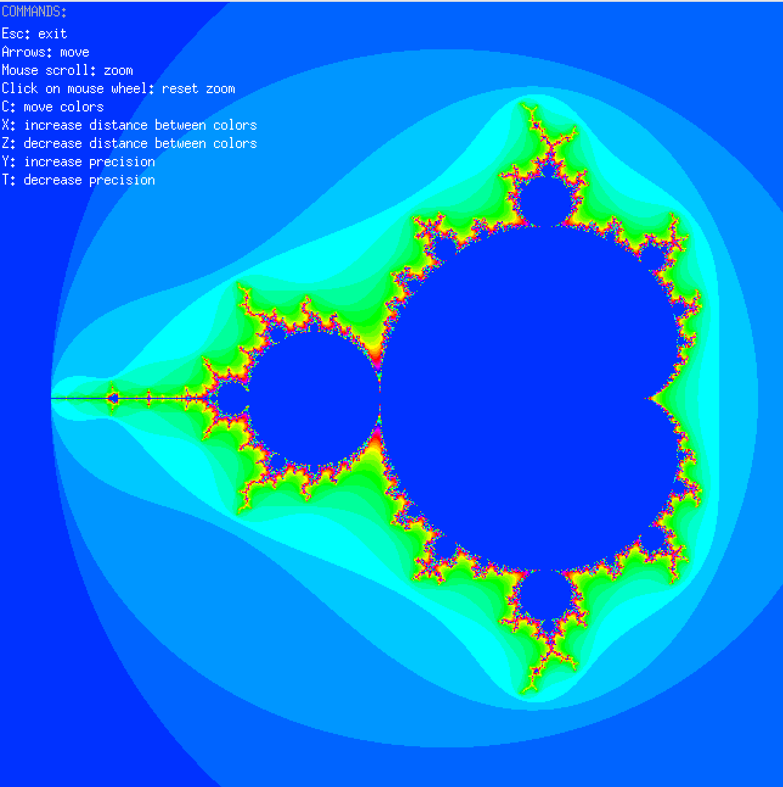
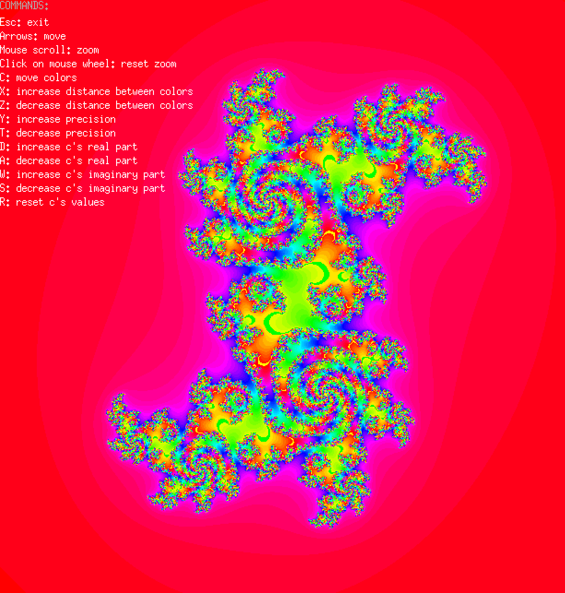
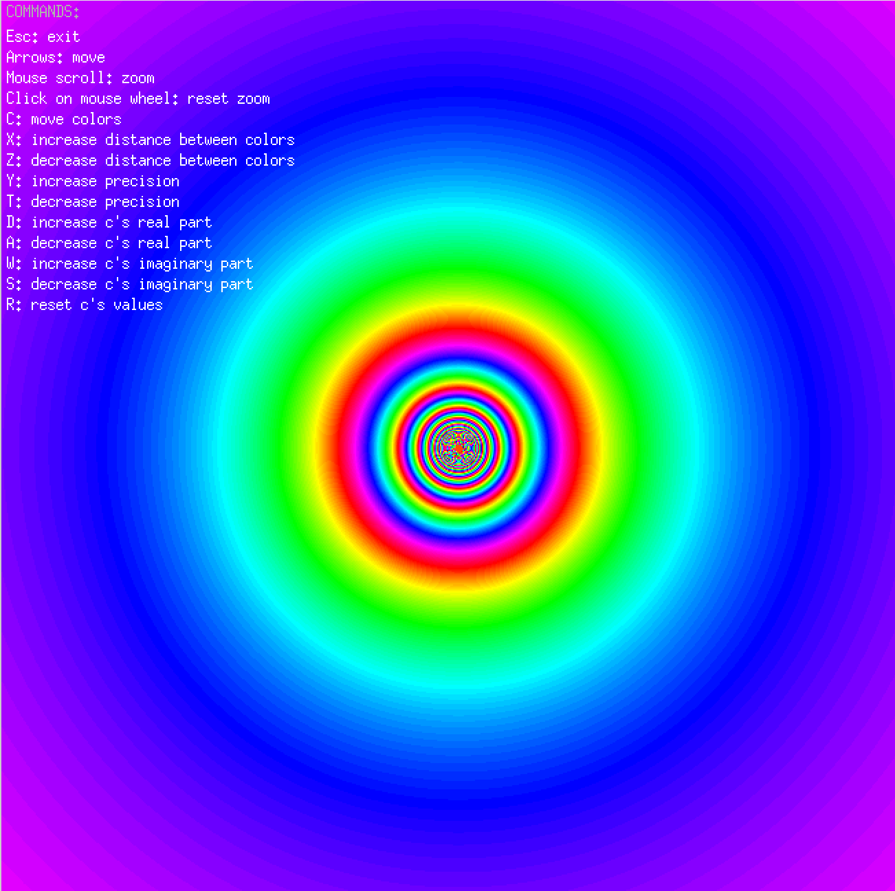
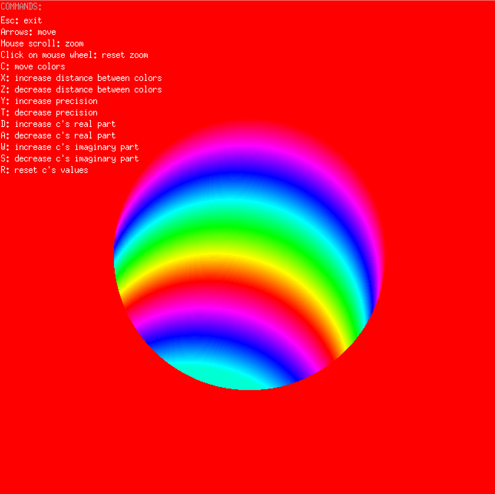

<<<<<<< HEAD
# ❄️ Fract-ol


A graphical exploration project to generate and interact with various fractals using **MinilibX**, a minimal graphics library restricted to single pixel manipulation.

## 📸 Gallery

<div align="center">
  
  
</div>
<div align="center">
  
  
</div>

## 🚀 Usage

### Linux prerequisites
Before building on Linux (or WSL), install the MiniLibX dependencies:
```bash
sudo apt-get update
sudo apt-get install xorg libxext-dev zlib1g-dev libbsd-dev
```

### Compilation
```bash
make
```

### Execution
Run the program with one of the following parameter sets:

#### 1. Mandelbrot Set
The classic Mandelbrot set.
```bash
./fractol Mandelbrot
```

#### 2. Julia Set
Generates different Julia sets based on the constant `c` passed as arguments.
```bash
./fractol Julia <real> <imaginary>
# Example:
./fractol Julia -0.8 0.156
```
*(If no arguments are provided, a default Julia set is rendered)*

#### 3. Custom Fractal
Allows you to experiment with the fractal formula $Z = Z^{exp} + C$.
```bash
./fractol Custom <z_exp> <is_c_inverted>
```
*   **z_exp**: The exponent power of Z iteration (e.g., 2 for standard Mandelbrot-like).
*   **is_c_inverted**: `1` to reciprocate C ($1/C$), `0` for normal C.

**Special Presets**:
*   `./fractol Custom 1 0` -> **Tunnel Effect** (Linear Z + C)
*   `./fractol Custom 1 1` -> **Sphere Effect** (Linear Z + 1/C)


## 🎮 Controls

### Navigation
*   **Arows**: Move the view.
*   **Mouse wheel**: Zoom.
*   **Click on mouse wheel**: Reset zoom.

### Colors
*   **C**: Move colors (Shift).
*   **X**: Increase distance between colors.
*   **Z**: Decrease distance between colors.

### Fractal Adjustments
*   **Y**: Increase precision (iterations).
*   **T**: Decrease precision (iterations).

### Modifying Complex Constant (Julia/Custom)
*   **D**: Increase c's real part.
*   **A**: Decrease c's real part.
*   **W**: Increase c's imaginary part.
*   **S**: Decrease c's imaginary part.
*   **R**: Reset c's values.

### System
*   **Esc**: Exit.

=======

# Fract-ol

Fract-ol is a graphical project that explores the mathematical beauty of fractals. Using the MinilibX library, this program renders the Mandelbrot set, the Julia set, and other custom variations in real-time, allowing users to explore these infinite patterns through zooming and color manipulation.

## Description

The project utilizes the mathematical properties of complex numbers to generate fractal images. It implements the escape time algorithm to determine pixel colors based on how quickly a sequence of complex numbers escapes a defined radius. The program is optimized for performance and includes interactive controls for navigation and parameter adjustment.

## Requirements

This project is designed to run on Linux. To compile and run the program, you need the following:

*   GCC compiler
*   Make
*   X11 include files and libraries (usually `libx11-dev` and `libxext-dev`)
*   Math library (standard with most C compilers)
*   MinilibX for Linux (included in the project structure)

## Compilation

To compile the mandatory part of the project, navigate to the root directory and run:

```bash
make
```

This will generate the executable named `fractol`.

To compile the bonus version (which includes additional features or the Custom fractal type), run:

```bash
make bonus
```

This will generate the executable named `fractol_bonus`.

To clean up object files:
```bash
make clean
```

To remove object files and the executable:
```bash
make fclean
```

## Usage

The program takes specific command-line arguments to determine which fractal to render.

### Mandelbrot Set
To render the standard Mandelbrot set:
```bash
./fractol Mandelbrot
```

### Julia Set
To render the Julia set. You can optionally provide starting values for the complex number constants (real and imaginary parts).
```bash
./fractol Julia
```
Or with specific coordinates:
```bash
./fractol Julia -0.4 0.6
```

### Custom (Bonus)
The bonus version supports a custom fractal type where you can define the exponent and inversion.
```bash
./fractol_bonus Custom <exponent> <inversion_flag>
```
*   `<exponent>`: The power to which Z is raised (e.g., 3, 4, etc.).
*   `<inversion_flag>`: 1 to invert the C constant, 0 otherwise.

## Controls

Once the window is open, you can interact with the fractal using the mouse and keyboard.

### Navigation and Zoom
*   **Mouse Wheel Scroll**: Zoom in and out (cursor position determines the zoom focus).
*   **Mouse Wheel Click**: Reset zoom and position.
*   **Arrow Keys**: Move the view (Pan Up, Down, Left, Right).

### Visuals and Iterations
*   **C**: Shift color palette.
*   **X**: Increase the color distance (jump).
*   **Z**: Decrease the color distance (jump).
*   **Y**: Increase precision (number of iterations).
*   **T**: Decrease precision (number of iterations).

### Fractal Modification (Julia / Custom)
These keys modify the complex constant *c* used in the Julia set generation:
*   **W**: Increase *c*'s imaginary part.
*   **S**: Decrease *c*'s imaginary part.
*   **D**: Increase *c*'s real part.
*   **A**: Decrease *c*'s real part.
*   **R**: Reset *c* values to the original state.

### System
*   **ESC**: Close the window and exit the program.
*   **Click X**: Close the window and exit the program.

## Technical Details

*   **Complex Numbers**: The rendering logic relies on complex number arithmetic (addition, multiplication, division).
*   **Optimization**: The project uses `-O3` optimization flags for faster rendering speeds.
*   **Event Handling**: User input is managed via X11 events hooked through MinilibX.
>>>>>>> 14a87a819a82c6925ba4665ed0ba3ff2df6df0b0
